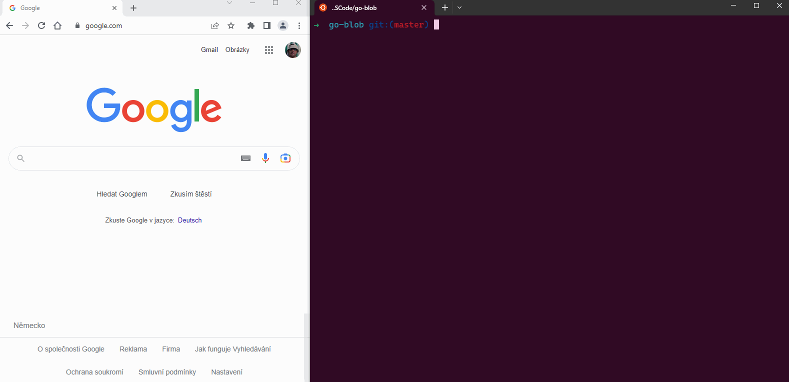
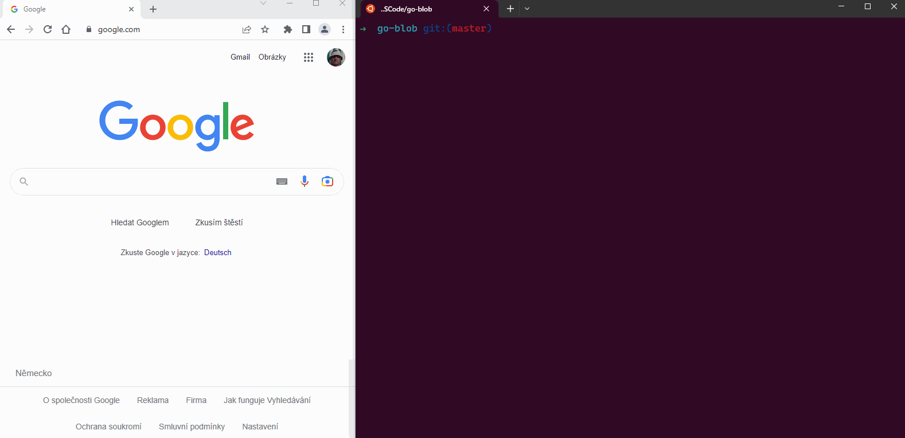

# Go Blob File Uploader

This is just small project to write simple API to upload files to specific Azure Storage account and Container.  For this purpose simple `Web Form` will be used. This WebForm consist of Browse and Upload botton.
You just need to pick up file from your drive and it will simply upload it to `predefined` Storage in Azure. 

At the end it will provide you new `SAS URI` which can be shared. URI has limited validity (`1 Day`).

**Possible usecase**
You could run this `GO binary` in container.
It can be used temporarily with `random` storage account. Quickly upload large files (Max size: `512MB`) and share these generated `links` with vendor, customer or internally. Also customers, vendors or someone can use this way to easily and securely upload some data, which will be then available for you.

`upload_page.html` is a template page which is used in Go code to render HTML with CSS styles. 

`main.go` is main function of whole project. 

Webpage should be located to : [http://localhost:9000/](http://localhost:9000/)


[Screenshot](/images/goblob_uploader.png "Just an basic view of webform.")


## Requirements 

### Environmnet variables

You need to define following Env vars:

```bash
export AZURE_STORAGE_ACCOUNT_NAME=<TargetStorageAccountName>
export AZURE_STORAGE_ACCOUNT_KEY=<XXXXXXXXXXXXXXXXXXXXXXXXXXX/XXXXXXXXXXXXXXXXXXXXXXX==>
export AZURE_STORAGE_ACCOUNT_CONTAINER=<TargetContainerName>
```

### Security concerns

The `provided code` does not contain any obvious `security flaws` as it does not accept any user input, only parses HTTP requests, and uploads and downloads files from an Azure Storage account using the `Azure Blob Storage Go SDK`. However, it is important to ensure that the environment variables `AZURE_STORAGE_ACCOUNT_NAME`, `AZURE_STORAGE_ACCOUNT_KEY`, and `AZURE_STORAGE_ACCOUNT_CONTAINER` are kept secure and are not exposed to unauthorized parties. Additionally, it is recommended to monitor and log any activity related to the storage account or the HTTP requests made to the server for potential security issues.

## How to Use
1. Setup `environment` variables. (Could be on your computer or you can get them from KeyVault on K8S)
2. To run `app locally` execute :
```bash
make build-app
./release/go-blob 
```




3. To `build container image` execute :
```bash
make docker-build
```
4. To run `app` in docker container run (It is not a Deamon to stop run `CTRL+C`): 
```bash
make start
```




5. To `clean` build run.
```bash
make cleanup #Will delete release/ folder
make delete #Will remove docker image
```

## Docker Registry

To pull built image from docker registry you can try 

```bash
docker pull patrikcze/go-blob:0.1.3
```

```bash
docker run --rm --name $(APP) -p 9000:9000 \
	-e AZURE_STORAGE_ACCOUNT_NAME=<storage account name> \
	-e AZURE_STORAGE_ACCOUNT_KEY=<shared key> \
	-e AZURE_STORAGE_ACCOUNT_CONTAINER=<containername> \
	$(REGISTRY)/$(IMAGE):$(TAG)
```

Following architectures have been published. 

- `linux/amd64`
- `linux/arm/v7`
- `linux/arm64`

Compressed size approx : `351 MB`


## Current issues
- 20.4.2023 - `Docker Image` Update to version 0.1.3 has been done.
- 20.4.2023 - `Fixed` / Progress bar fixed, style can be improved little bit. 
- 19.4.2023 - `Microsoft GO SDK` implemented in [Dev](https://github.com/patrikcze/go-blob/tree/dev) branch
- 12.4.2023 - `Still persist` / Progress and Counter CSS via Javascript does not work properly.
- 10.4.2023 - `Fixed` / SAS URI links are fully functional and properly formatted. 